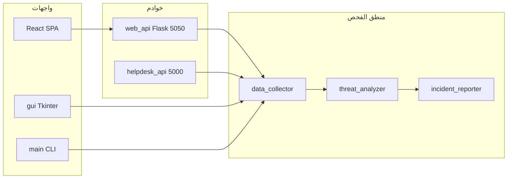

# وثيقة تعريف مشروع C.O.A لصديقك

وثيقة عربية جاهزة للنسخ أو المشاركة: فكرة المشروع، ما تعرضه الواجهات من «صفحات» أو تبويبات، ودور أهم الملفات.

---

## فكرة المشروع

**C.O.A (Council of Agents)** — نظام فحص أمني يعمل **محلياً** على الجهاز: يجمع بيانات عن النظام (عمليات، شبكة، إلخ)، يحللها بحثاً عن مؤشرات تهديد، ويولّد تقارير (نص، HTML، تقرير حادث). يدعم تكامل **VirusTotal** و**YARA**، ويعتمد على عدة «وكلاء» (CrewAI) بما فيها وكيل **تقرير الحوادث** مع ربط بإطار **MITRE ATT&CK**. التفاصيل المعمارية موثقة في [README.md](README.md) وتشغيل الواجهات في [README-تشغيل.md](README-تشغيل.md).

---

## «الصفحات» — ماذا يرى المستخدم؟

المشروع **ليس موقعاً متعدد المسارات (routes)** بالمعنى التقليدي؛ الواجهات الرئيسية كالتالي:

| الواجهة | العنوان / المسار | ماذا يحتوي؟ |
|--------|-------------------|-------------|
| **واجهة React (موصى بها)** | `http://localhost:5173` (Vite) + API على `http://127.0.0.1:5050` | **صفحة واحدة (SPA)** في [web/src/App.tsx](web/src/App.tsx): رأس العنوان، زر بدء الفحص، خيار dry-run، إحصائيات، ثم **تبويبات**: Threats، Processes، Network، Logs، وأزرار تنزيل التقارير بعد فحص ناجح. |
| **واجهة Tkinter** | تشغيل سطح المكتب عبر `python gui.py` | واجهة رسومية قديمة بنفس الفكرة تقريباً: فحص، جداول، تبويبات، تصدير. |
| **سطر الأوامر CLI** | `python main.py` | لا «صفحة»؛ مخرجات في الطرفية وتقارير في مجلد `reports/`. |
| **تقرير HTML ثابت (مثال)** | ملف مثل [reports/COA_Report.html](reports/COA_Report.html) | تقرير تفاعلي يُنشأ بعد الفحص (وليس صفحة تنقل داخل التطبيق). |
| **Helpdesk API** | منفذ **5000** عند `python helpdesk_api.py` | REST للبوتات/التكامل، وليس واجهة مستخدم بصرية. |

**ملفات الويب الداعمة لـ React:** [web/index.html](web/index.html) (نقطة الدخول)، [web/src/main.tsx](web/src/main.tsx) (ربط React بالـ DOM)، [web/vite.config.ts](web/vite.config.ts) (إعداد Vite والـ proxy للـ API إن وُجد).

---

## أهم الملفات ووظيفة كل واحد

### جذر المشروع

- **[main.py](main.py)** — نقطة الدخول الرئيسية: فحص CLI، خيارات (`--dry-run`, `--vt`, `--yara`, `--gui`, `--helpdesk`، إلخ)، تنسيق التحليل والتقارير.
- **[web_api.py](web_api.py)** — خادم **Flask** للواجهة الحديثة: مسارات مثل `/api/health` و`/api/scan` وتنزيل التقارير؛ يستدعي جمع البيانات والتحليل ووكيل التقرير.
- **[react_gui.py](react_gui.py)** — يشغّل نفس تطبيق Flask من `web_api` على المنفذ **5050** مع رسائل توضيحية للمطور.
- **[gui.py](gui.py)** — واجهة **Tkinter** القديمة.
- **[helpdesk_api.py](helpdesk_api.py)** — API مخصص لتكامل **Helpdesk / بوت** (مثلاً `/health`, `/scan`, إلخ حسب README).
- **[requirements.txt](requirements.txt)** — تبعيات Python.
- **[README.md](README.md)** — وثائق المشروع والهيكل.
- **[README-تشغيل.md](README-تشغيل.md)** — خطوات التشغيل السريعة (طرفيتان لـ React + استكشاف أخطاء).

### `config/`

- **[settings.py](config/settings.py)** — إعدادات عامة (مثل مسارات التقارير والمجلدات).

### `agents/`

- **[council.py](agents/council.py)** — منطق «مجلس الوكلاء» الأصلي (CrewAI) للمهام المتخصصة.
- **[incident_reporter.py](agents/incident_reporter.py)** — الوكيل الرابع: تقرير حادث، تصنيف شدة، ملخص تنفيذي، MITRE، إلخ.
- **[prompts.py](agents/prompts.py)** — نصوص الـ prompts للوكلاء.

### `core/`

- **[data_collector.py](core/data_collector.py)** — جمع بيانات النظام (عمليات، شبكة، …).
- **[threat_analyzer.py](core/threat_analyzer.py)** — تحليل التهديدات والنتائج المجمّعة.
- **[solution_engine.py](core/solution_engine.py)** — اقتراح/تحقق من خطوات المعالجة (مع دعم محاكاة).
- **[virustotal.py](core/virustotal.py)** — تكامل VirusTotal.
- **[yara_engine.py](core/yara_engine.py)** — محرك قواعد YARA.
- **[rules/baseline.yar](core/rules/baseline.yar)** — ملف قواعد YARA الجاهزة.

### `utils/`

- **[admin_check.py](utils/admin_check.py)** — التحقق من صلاحيات المسؤول عند الحاجة.
- **[ui_manager.py](utils/ui_manager.py)** — واجهة طرفية غنية (Rich) لـ CLI.
- **[report_generator.py](utils/report_generator.py)** — تقارير نصية وسجل أحداث الفحص.
- **[html_report.py](utils/html_report.py)** — توليد تقرير HTML.
- **[logger.py](utils/logger.py)** — تسجيل منظم.
- **[cache.py](utils/cache.py)** — تخزين مؤقت للبيانات/النتائج.

### `tests/`

- **[test_core.py](tests/test_core.py)** و **[test_v3_features.py](tests/test_v3_features.py)** — اختبارات الوحدات للميزات الأساسية وإصدار v3.

### `web/src/` (واجهة React)

- **[App.tsx](web/src/App.tsx)** — كل الواجهة: حالة الفحص، الجلب من `/api/scan`، التبويبات، التصدير.
- **[main.tsx](web/src/main.tsx)** — تشغيل التطبيق على عنصر `#root`.
- **[vite-env.d.ts](web/src/vite-env.d.ts)** — أنواع TypeScript لبيئة Vite.

### مجلدات مخرجات

- **`logs/`** — سجلات تُنشأ تلقائياً.
- **`reports/`** — مخرجات الفحص (TXT، HTML، إلخ).

---

## مخطط تدفق مختصر

