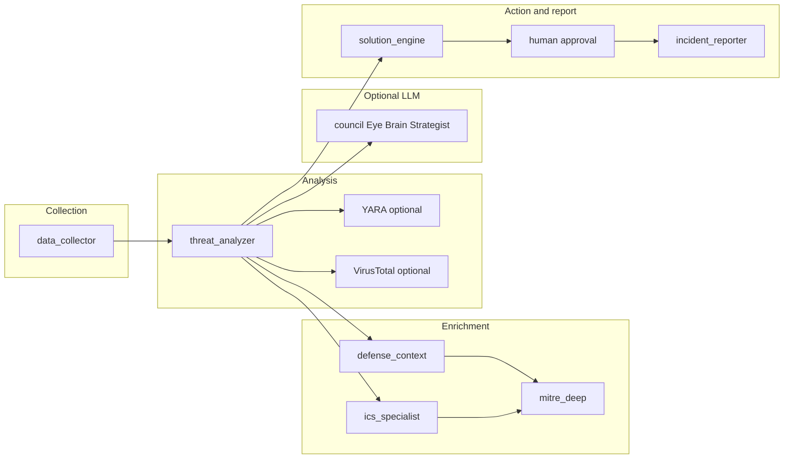

# فهرس الوكلاء والطبقات — C.O.A (مرجع مركزي)

ملف واحد للبحث السريع: **من يفعل ماذا، أين الكود، متى يعمل، وما الفجوات**. للتفاصيل الطويلة لكل وكيل راجع مجلد [wokala/](wokala/).

---

## جدول سريع

| # / الطبقة | الاسم (عرض) | الملف الرئيسي | LLM أم حتمي | متى يعمل |
|------------|-------------|---------------|-------------|----------|
| — | Threat Analyzer (محرك تهديدات) | [core/threat_analyzer.py](../core/threat_analyzer.py) | حتمي | كل فحص CLI/ويب؛ يغذي بقية المسار |
| — | جمع بيانات النظام | [core/data_collector.py](../core/data_collector.py) | حتمي | قبل التحليل؛ ليس وكيل CrewAI |
| 1 | The Eye (System Data Collector) | [agents/council.py](../agents/council.py) | CrewAI + Ollama | `--council` أو `POST /api/scan` مع `use_council: true` |
| 2 | The Brain (Threat Hunter) | [agents/council.py](../agents/council.py) | CrewAI + Ollama | نفس مسار المجلس |
| 3 | The Strategist (Solution Advisor) | [agents/council.py](../agents/council.py) | CrewAI + Ollama | نفس مسار المجلس (مخرج نصي فقط) |
| 4 | Incident Reporter | [agents/incident_reporter.py](../agents/incident_reporter.py) | حتمي (Python) | نهاية الفحص؛ تقارير MD/CSV وغيرها |
| 5 | Defense Context Analyzer | [agents/defense_context_analyzer.py](../agents/defense_context_analyzer.py) → [core/defense_context_engine.py](../core/defense_context_engine.py) | حتمي | بعد `threats`؛ ملفات YAML محلية |
| 6 | ICS Specialist (OT) | [agents/ics_specialist.py](../agents/ics_specialist.py) | حتمي | بعد تحليل OT/ICS في الفحص |

**حلول قابلة للموافقة البشرية:** [core/solution_engine.py](../core/solution_engine.py) — ليست وكيل CrewAI؛ تُبنى من قائمة `threats` الناتجة عن المحرك الحتمي.

---

## تسلسل التشغيل (CLI)

في [main.py](../main.py) باختصار: جمع (`SystemDataCollector`) → تحليل (`ThreatAnalyzer`) → اختياري YARA / VirusTotal → الوكيل 5 + OT/ICS + MITRE عميق → اختياري مجلس CrewAI → `SolutionEngine` + موافقة → الوكيل 4 للتقارير.



---

## الفرق بين المحرك الحتمي ومجلس CrewAI (1–3)

| ThreatAnalyzer + data_collector | وكلاء المجلس (Eye / Brain / Strategist) |
|---------------------------------|----------------------------------------|
| يعملان في كل فحص بدون Ollama | يحتاجان Ollama + `crewai` + تفعيل صريح |
| يحددان `threats` التي تمرّ على الحلول والتقارير | يعيدان صياغة تفسيرية لبيانات مُجمَّعة وقائمة تهديدات موجودة مسبقاً |
| المصدر الوحيد لـ `SolutionEngine` | المخرج: **تقرير نصي** (`run_council_on_scan` → `report`)؛ **لا** يُمرَّر تلقائياً إلى حلقة الموافقة على الأوامر |

للمزيد: [wokala/00_threat_engine.md](wokala/00_threat_engine.md) وملفات `01`–`03` في نفس المجلد.

---

## أوامر وتشغيل ذي صلة

من داخل مجلد `COA_Project/`:

```bash
python main.py                          # فحص CLI بدون مجلس LLM
python main.py --council                # بعد الفحص: CrewAI + Ollama (الوكلاء 1–3)
python main.py --gui                    # API للواجهة React؛ راجع تعليمات الطرفية
python main.py --dry-run                # محاكاة دون تنفيذ أوامر
python -m agents.council                # اختبار اتصال Ollama والمجلس
```

**واجهة الويب:** [web_api.py](../web_api.py) — حقل JSON `use_council` يفعّل نفس مسار `run_council_on_scan` عند الفحص.

---

## روابط تفصيلية (wokala)

| الموضوع | الملف |
|---------|--------|
| محرك التحليل الحتمي | [wokala/00_threat_engine.md](wokala/00_threat_engine.md) |
| الوكيل 1 — The Eye | [wokala/01_agent_eye.md](wokala/01_agent_eye.md) |
| الوكيل 2 — The Brain | [wokala/02_agent_brain.md](wokala/02_agent_brain.md) |
| الوكيل 3 — The Strategist | [wokala/03_agent_strategist.md](wokala/03_agent_strategist.md) |
| الوكيل 4 — Incident Reporter | [wokala/04_agent_incident_reporter.md](wokala/04_agent_incident_reporter.md) |
| الوكيل 5 — Defense Context | [wokala/05_agent_defense_context.md](wokala/05_agent_defense_context.md) |
| الوكيل 6 — ICS Specialist | [wokala/06_agent_ics_specialist.md](wokala/06_agent_ics_specialist.md) |
| فهرس المجلد | [wokala/README.md](wokala/README.md) |

رؤية المشروع عالية المستوى (قد تختلف عن التنفيذ الحالي): [PROTOTYPE_PROMPT.md](../PROTOTYPE_PROMPT.md).

---

## نواقص وفرص تحسين (checklist للتنفيذ لاحقاً)

استخدم هذا القسم عند التخطيط للربط أو توحيد التسمية.

- [ ] **ربط مخرجات CrewAI بالتنفيذ:** اليوم `run_council_on_scan` في [agents/council.py](../agents/council.py) يعيد تقريراً نصياً فقط؛ لا يوجد مسار يمرّر اقتراحات «Strategist» إلى `SolutionEngine` أو موافقة المستخدم.
- [ ] **توضيح تسمية «The Strategist» في CLI:** مرحلة الحلول في الواجهة النصية قد تشير لنفس الاسم بينما التنفيذ الفعلي للأوامر من `SolutionEngine` على `threats` الحتمية.
- [ ] **مواءمة PROTOTYPE مع الواقع:** الوثيقة التسويقية قد تصف «الوكيل 1» كجامع `psutil`؛ في الكود الجمع الفعلي في `core/data_collector` والوكيل 1 في CrewAI يُعيد تنظيم/تلخيص ما وصل مسبقاً.
- [ ] **تنظيف الالتباس في الجذر:** نسخ مثل `council.py` / `prompts.py` خارج `COA_Project/` إن وُجدت — اعتمد مسار [COA_Project/](../) للتطوير والمراجع.

---

*آخر تحديث للهيكل: يتوافق مع `main.py` و`web_api.py` في مستودع C.O.A.*
